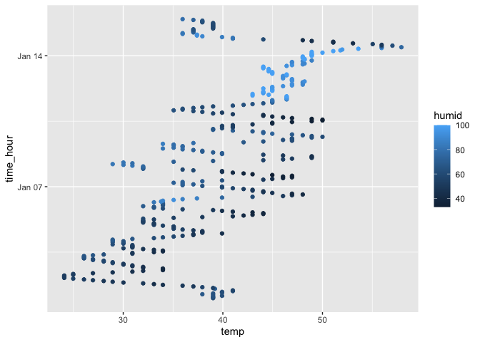

Homework 1
================
Ekaterina Hofrenning
2023-09-14

Load Libraries:

``` r
library(tidyverse)
library(moderndive)
```

# Question 1:

*Write a short description of the dataset using inline R code; accessing
the dataset help file can be informative. In your discussion, please
include:*

- *the variables in this dataset, including names / values of important
  variables*
- *the size of the dataset (using nrow and ncol)*
- *the mean temperature*

*Make a scatterplot of temp (y) vs time_hour (x); color points using the
humid variable (adding color = … inside of aes in your ggplot code
should help). Describe patterns that are apparent in this plot. Export
your scatterplot to your project directory using ggsave.*

``` r
data("early_january_weather") # load data

names(early_january_weather) # var names
```

    ##  [1] "origin"     "year"       "month"      "day"        "hour"      
    ##  [6] "temp"       "dewp"       "humid"      "wind_dir"   "wind_speed"
    ## [11] "wind_gust"  "precip"     "pressure"   "visib"      "time_hour"

``` r
nrow(early_january_weather) # number of rows
```

    ## [1] 358

``` r
ncol(early_january_weather) # number of cols
```

    ## [1] 15

``` r
mean(early_january_weather$temp) # mean temp
```

    ## [1] 39.58212

``` r
ggplot(early_january_weather, aes(x = temp, y = time_hour, color = humid)) + geom_point()
```

<!-- -->

``` r
ggsave("temp_time_humid.png")
```

    ## Saving 7 x 5 in image

The `early_january_weather` dataset contains variables about
temperature, dew point, humidity, wind direction, wind speed, and wind
gust, precipitation, sea level pressure, and visibility metrics in
addition to the date and time each was measured in January. In total,
there are 358 observations and 15 variables. The mean temperature is
39.58 degrees. There appears to be a slight positive trend between
temperature and the date. On each day, the temperature increases and
decreases as the hours go on. Some days are more humid than others–
January 12-14th is a stretch of days with high humidity.

# Question 2:

*Create a data frame comprised of:*

- *a random sample of size 10 from a standard Normal distribution*
- *a logical vector indicating whether elements of the sample are
  greater than 0*
- *a character vector of length 10*
- *a factor vector of length 10, with 3 different factor “levels”*

*Try to take the mean of each variable in your dataframe. What works and
what doesn’t?*

``` r
my_data <- # create dataset
  tibble(
  samp = rnorm(10, mean = 0, sd = 1),
  big_0 = samp > 0,
  char = c("A", "B", "C", "D", "E", "F", "G", "H", "I", "J"),
  fact = factor(c("low", "low", "med", "med", "high", "high", "low", "high", "med", "low"))
  )

my_data %>% summarize_all(mean) # calculate means
```

    ## # A tibble: 1 x 4
    ##     samp big_0  char  fact
    ##    <dbl> <dbl> <dbl> <dbl>
    ## 1 -0.231   0.4    NA    NA

When taking the mean of each variable in my dataframe, the means for the
random sample and logical vectors works while the means for the
character and factor vectors do not work.

*In some cases, you can explicitly convert variables from one type to
another. Write a code chunk that applies the as.numeric function to the
logical, character, and factor variables (please show this chunk but not
the output). What happens, and why? Does this help explain what happens
when you try to take the mean?*

``` r
my_data %>% 
  mutate(as.numeric(big_0),
         as.numeric(char),
         as.numeric(fact))
```

After applying as.numeric() to the logical, character, and factor
variables, the logical vector turns into 0s and 1s (0=F, 1=T), the
character vector fails to convert and becomes NAs, and the factor
variable turns into 1s,2s, and 3s. This makes sense because: logical
variables are the same if you think about them in terms of 0/1’s or
T/F’s, character vectors are a composition of letters so they can’t be
thought of in the numeric sense, and factor variables are groups so they
could be assigned a number for each group. This helps when thinking
about taking the means because character and factor variables don’t have
ordinal and numeric properties, while the logical vector can be read by
the computer as 0s and 1s to take the mean.
